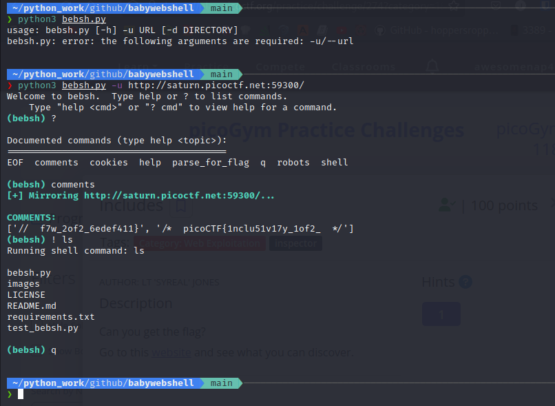

# bebsh - babywebshell

[](https://github.com/psf/black)

A terminal application that utilizes webwizard to automate easy web CTF challenges.

## Table of Contents
* [General Info](#general-information)
* [Technologies](#technologies)
* [Features](#features)
* [Screenshots](#screenshots)
* [Setup](#setup)
* [Project Status](#project-status)
* [Room for Improvement](#room-for-improvement)
* [Contact](#contact)
* [License](#license)

## General Information
The purpose of this project is for me to practice making a python project and use the `cmd` module. I will continue to add features to make web CTF challenges easier as I learn more about web exploitation.

## Technologies Used
- Python 3.10.4

## Features
Helpful features:
- command autocompletion
- running shell commands
- colored prompt and status information

Commands available:
- `robots` - Sends a request for robots.txt, and returns a dictionary with organized information if it exists.
- `comments` - Mirrors website and returns a list of js, css, and html comments.
- `cookies` - Gets any cookies sent by the server after requesting the URL.
- `parse_for_flag <CRIB>` - Mirrors website, parses it for specified crib and returns list of possible flags.
- `shell <CMD>` - Run a shell command (you can also use ! <CMD>)
- `q` and `EOF (Ctrl+d)` - Quit the program.

## Screenshots


## Setup
```
$ git clone https://github.com/Magicks52/babywebshell.git
$ cd ./babywebshell/
# install required packages
$ pip3 install -r requirements.txt
$ python3 bebsh.py -h
```
**Note: you may have to run bebsh.py with `sudo` to mirror remote website.**

## Project Status
Project is: _complete (for now)_

## Room for Improvement
I'm open to suggestions!

To Do:
- add more commands

## Contact
Created by [@Magicks52](https://github.com/Magicks52) - feel free to contact me!
- Discord - John Nguyen#7086

## License
This project is open source and available under the [MIT License](./LICENSE).